# Yanmeng Project | 研梦考研信息化服务平台

<p align="center">
  <a href="docs/media/yanemengvideo15mbcrop1.mp4">
    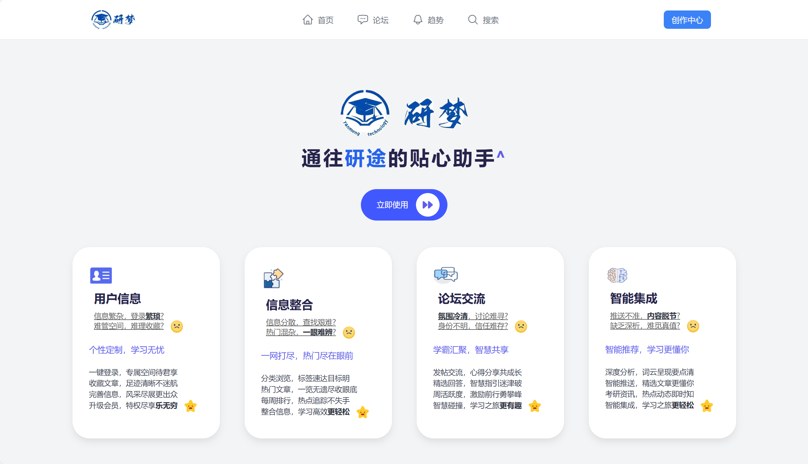
  </a>
</p>

<p align="center">
  <a href="docs/media/yanemengvideo15mbcrop1.mp4"><strong>▶ 点击播放项目演示视频</strong></a>
</p>

<p align="center">
  <a href="./README_EN.md">English</a> · 中文
</p>

<p align="center">
  
  
  
  
  
</p>

<p align="center">
  <a href="#-核心优势">核心优势</a> ·
  <a href="#-功能展示">功能展示</a> ·
  <a href="#-快速启动">快速启动</a> ·
  <a href="#-演示账号">演示账号</a> ·
  <a href="#-开源发布建议">开源建议</a>
</p>

## 项目简介

**研梦（Yanmeng）** 是一个面向考研场景的信息化服务平台，聚焦「内容获取 + 交流互动 + 趋势分析 + 后台治理」一体化能力。

- 前台能力：文章、论坛、搜索、趋势词云、用户中心
- 管理能力：后台精细化审核与内容治理（`/admin`）
- 协作能力：可视化接口文档（`/docs`），前后端联调更高效

## 核心优势

### 1. 全链路产品闭环

- 用户从浏览、搜索到发帖、互动形成完整路径
- 管理侧可对用户、文章、帖子统一治理
- 适合课程项目、毕设、校内运营平台二次开发

<p align="center">
  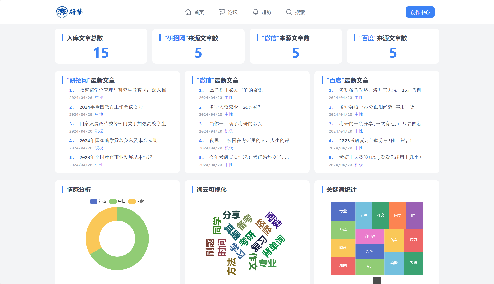
</p>

### 2. 后台管理能力突出（`/admin`）

- Django Admin + SimpleUI，界面统一、维护成本低
- 支持用户、文章、帖子等对象快速筛查与处理
- 细粒度内容管理，适配真实社区治理场景

<p align="center">
  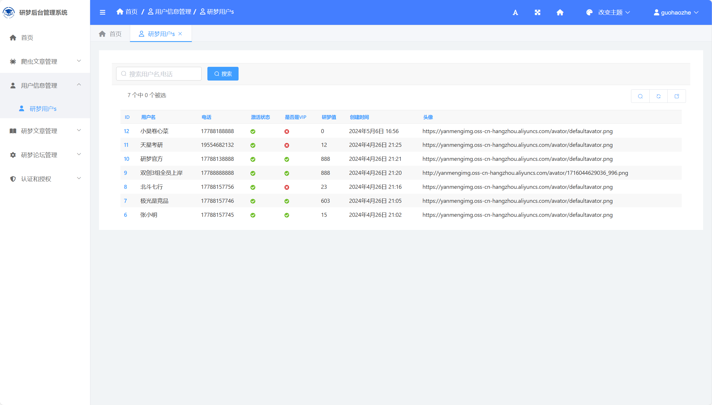
</p>

### 3. 接口文档可直接使用（`/docs`）

- 文档入口：`http://127.0.0.1:8000/docs/`
- 参数、路由、返回结构更清晰
- 降低新成员上手成本，提升联调效率

<p align="center">
  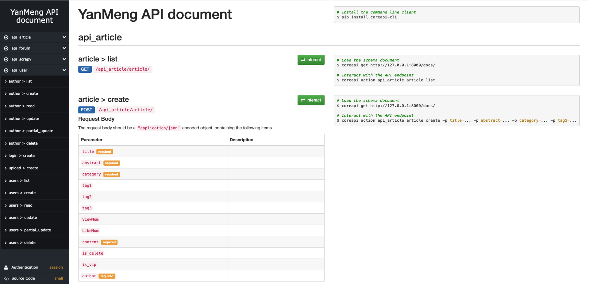
</p>

## 功能展示

### 文章列表

- 分类浏览、推荐聚合，信息组织清晰。

<p align="center">
  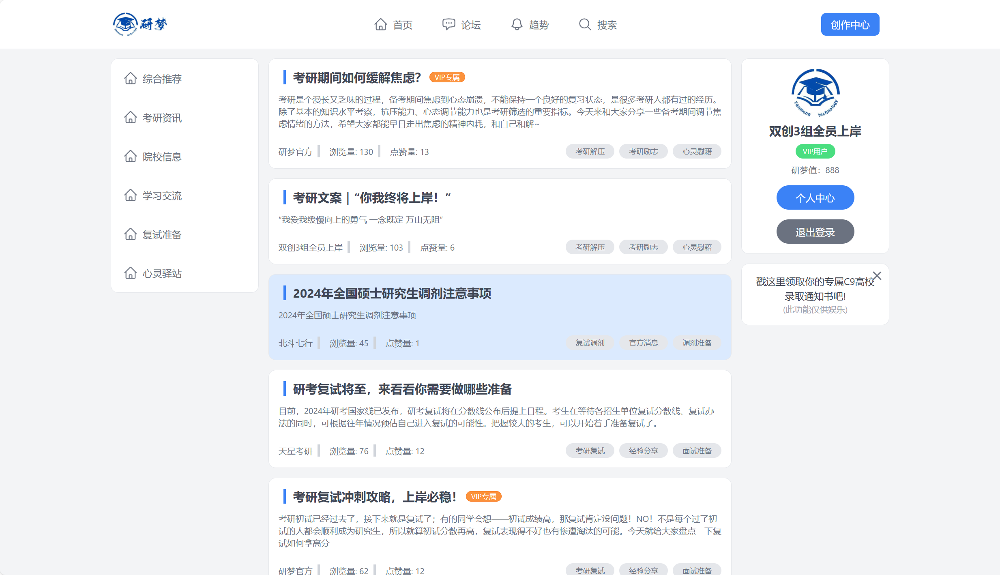
</p>

### 文章详情

- 面向深度阅读与内容沉淀，适合考研资料场景。

<p align="center">
  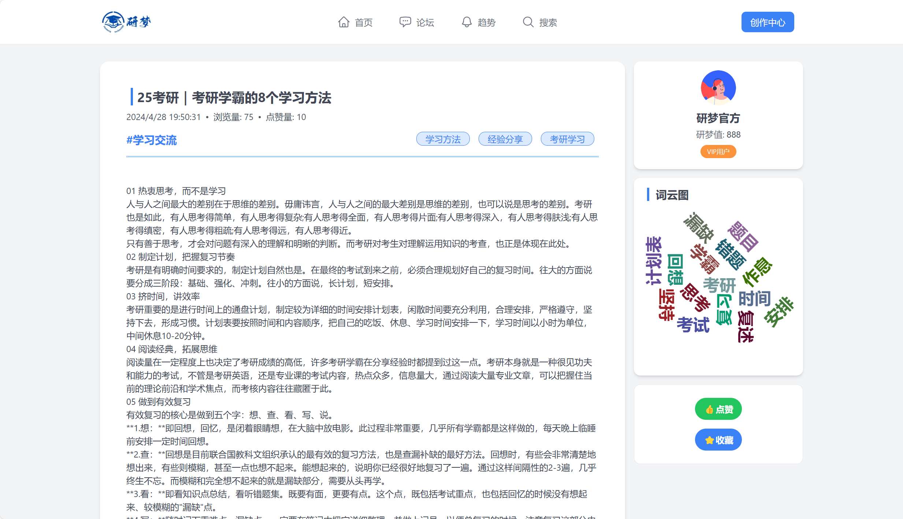
</p>

### 文章创作

- 提供内容发布能力，支持平台内容持续增长。

<p align="center">
  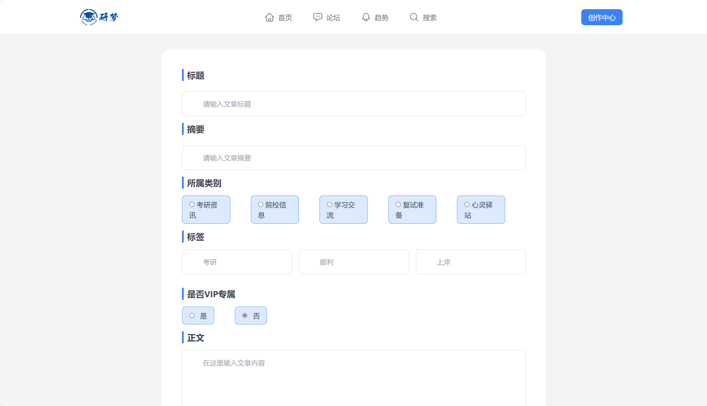
</p>

### 论坛列表

- 支持按主题查看讨论，突出社区交流属性。

<p align="center">
  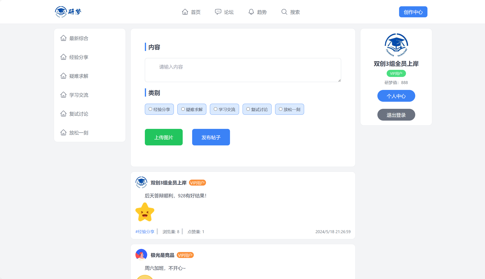
</p>

### 论坛详情

- 帖子详情与互动展示，利于经验共享与问题解答。

<p align="center">
  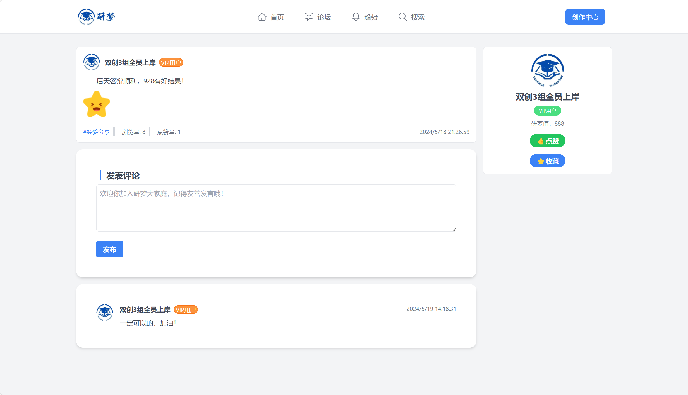
</p>

### 搜索页面

- 统一检索文章与帖子，快速定位目标信息。

<p align="center">
  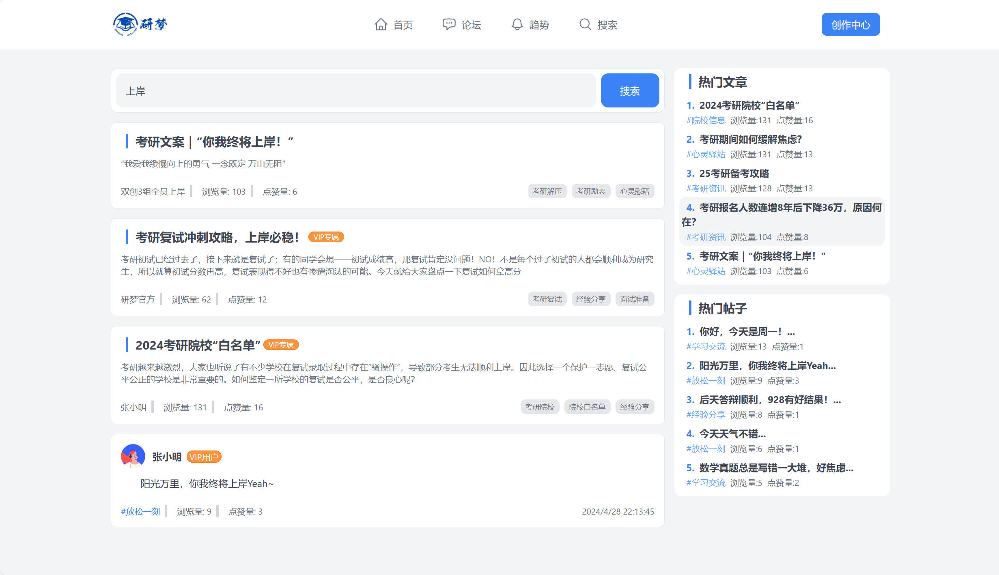
</p>

### 趋势词云

- 对热门内容进行可视化分析，提升信息洞察效率。

<p align="center">
  
</p>

### 登录 / 注册 / 个人中心

<p align="center">
  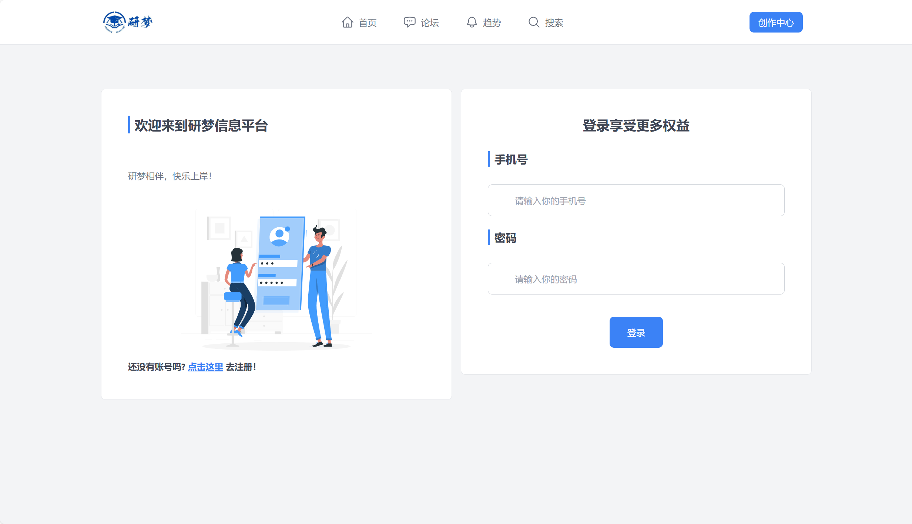
  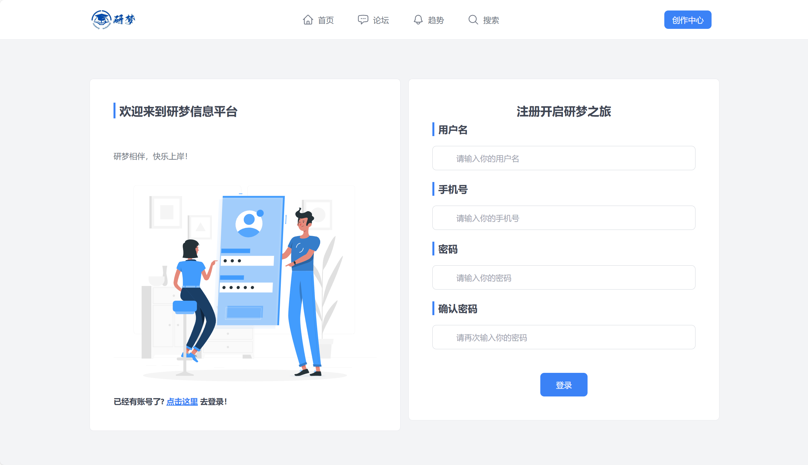
  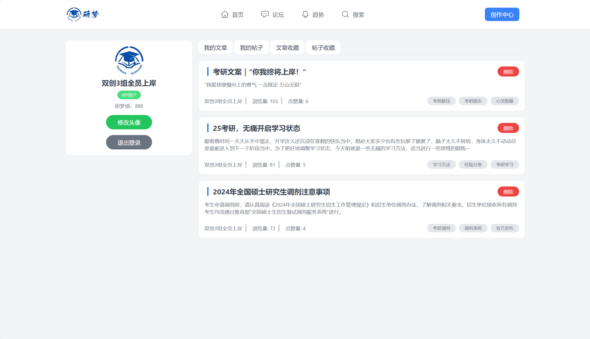
</p>

## 快速启动

### 1) 克隆仓库

```bash
git clone <YOUR_REPO_URL>
cd yanmengProject
```

### 2) 后端（conda 推荐）

```bash
conda create -n yanmeng python=3.8 -y
conda activate yanmeng

cd ymbackend
pip install -r requirements.txt

# 开源部署建议：使用你自己的密钥
export DJANGO_SECRET_KEY='replace-with-your-own-secret-key'

python manage.py migrate
python manage.py runserver 127.0.0.1:8000
```

### 3) 前端

```bash
cd ../ymfrontend
npm install
npm run dev
```

### 4) 访问入口

- 前端：`http://localhost:5173`
- 后台：`http://127.0.0.1:8000/admin/`
- 文档：`http://127.0.0.1:8000/docs/`

## 演示账号

### 后台管理员

- 用户名：`admin`
- 密码：`YanmengAdmin@2026!`

> 首次运行后请立即修改后台密码。

### 前台演示账号

- 手机号：`18800000001`
- 密码：`demo123456`

可选账号：`18800000002` ~ `18800000007`（密码同上）。

## 项目结构

```text
yanmengProject/
├─ ymbackend/              # Django backend
│  ├─ ymbackend/           # settings, urls
│  ├─ userInfo/            # user app
│  ├─ ymblog/              # article app
│  ├─ ymforum/             # forum app
│  └─ media/               # local static/media assets
├─ ymfrontend/             # Vue3 + Vite frontend
└─ docs/
   ├─ images/showcase/     # README image
   └─ media/               # README video
```

## 开源发布建议

- 生产环境关闭 `DEBUG`，收紧 `ALLOWED_HOSTS`
- 所有密钥使用环境变量，不要硬编码
- 建议补充 `LICENSE`、`CONTRIBUTING.md`、`CODE_OF_CONDUCT.md`
